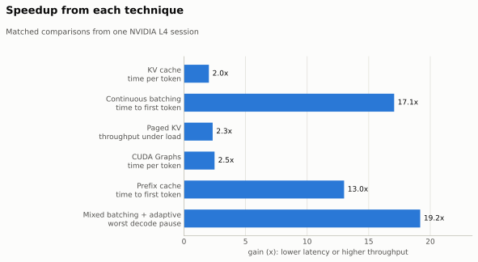
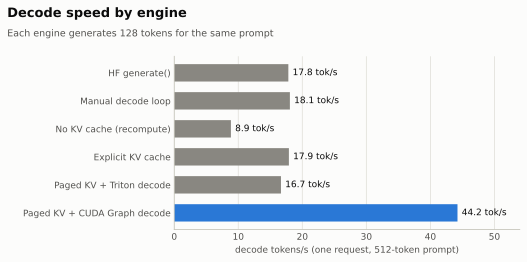
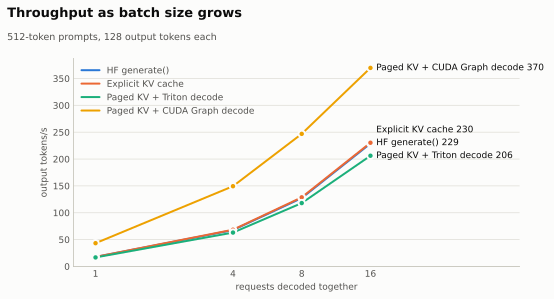
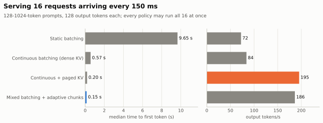
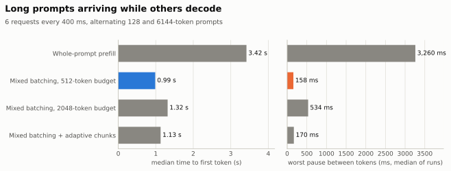
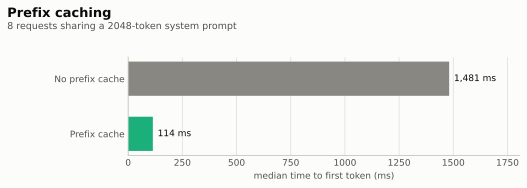
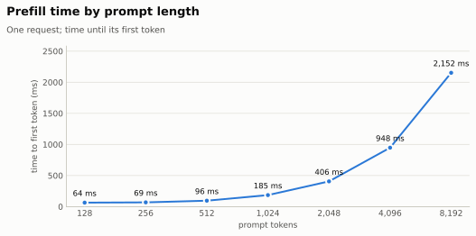

# MiniLLM-L4

An LLM inference engine for `Qwen/Qwen3-4B-Instruct-2507-FP8` on one NVIDIA L4.
Each technique below removes one specific bottleneck; the table shows the
metric it targets, measured without and with it.

All numbers come from one L4 session (1 warm-up + 3 measured runs per case,
medians) using `benchmarks/commands/run_showcase.py`. Every comparison changes
only the technique in that row, and no run hit GPU memory pressure (zero
allocator retries). Raw JSON stays local and is regenerated by the Reproduce
command.

| Technique | Problem it fixes | Without | With | Gain |
|---|---|---|---|---|
| KV cache | recomputing the whole prompt for every new token | 113.0 ms/token | 55.9 ms/token | **2.0x** |
| Continuous batching | new requests wait for the running batch to finish | 9.65 s to first token | 0.57 s | **17x** |
| Paged KV | copying and re-padding caches as the batch changes | 83.9 tok/s | 195.4 tok/s | **2.3x** |
| CUDA Graphs¹ | GPU idle between ~2,000 kernel launches per token | 56.1 ms/token | 22.6 ms/token | **2.5x** |
| Prefix cache | re-processing the same system prompt | 1,481 ms to first token | 114 ms | **13x** |
| Mixed batching + adaptive chunks | a long prompt freezing everyone who is decoding | 3.26 s worst pause | 0.17 s | **19x** |

<picture>
  <source media="(prefers-color-scheme: dark)" srcset="docs/assets/showcase/speedups-dark.svg">
  
</picture>

¹ Measured on the static-batch decode engine. The continuous/mixed serving
engine does not use CUDA Graphs yet; that is the next step.

Workloads: KV cache and CUDA Graphs use one request with a 512-token prompt
(the KV-cache gap grows with prompt length). Continuous batching and paged KV
serve 16 requests (128-1024-token prompts) arriving every 150 ms, with every
policy allowed to run all 16 at once. The prefix cache serves 8 requests that
share a 2048-token system prompt. Mixed batching serves 6 requests that
alternate 128- and 6144-token prompts while earlier requests decode; its worst
pause is the median over runs of each run's longest gap between two tokens.

<details>
<summary>How each technique works</summary>

- **KV cache:** Keeps each layer's keys/values so a new token attends to cached history instead of re-running the prompt. Capacity, positions, and release have explicit ownership instead of opaque library state.
- **Continuous batching:** Admits new requests between decode steps and retires finished ones immediately, instead of waiting for a static batch to drain. With paged KV, a request waits only when KV memory is actually full.
- **Paged KV:** Uses fixed-size KV pages with per-request block tables, a fused Triton paged-decode kernel, and flattened (packed) prefill with `cu_seqlens`, so batch changes require no cache copying. Eager paged decode is slightly slower per step (60 vs 56 ms for one request), but it removes copies, uses less memory, and enables graph capture.
- **CUDA Graphs:** Decode was host-bound (~2,000 kernel launches per token, GPU ~40% busy); replaying a captured graph per batch size removes launch overhead (GPU ~95% busy). FP8 kernel autotuning is bucketed and pre-tuned so it never runs inside a request.
- **Prefix cache:** Identical prompt prefixes share immutable KV pages. Reference counts track shared ownership, with LRU eviction to reclaim pages.
- **Mixed batching + adaptive chunks:** Each iteration is one forward pass holding every decode token plus prompt chunks, shortest prompt first; a self-calibrating cost model chooses chunk size by time (about 150 ms when busy, 400 ms when idle), with aging so long prompts are not starved. Lower-right causal FlashAttention keeps chunked prefill bit-identical to whole-prompt prefill. On this workload a fixed 512-token budget does as well; adaptive sizing pays off when a long prompt runs on an idle engine, where it finishes the long prompt fastest while a newcomer still waits under 0.6 s (see [chunked prefill notes](docs/phase_notes/chunked_prefill.md)).

</details>

**Correctness.** Every engine was checked token for token against Hugging Face
`generate()` on the validation workloads, with one documented exception (an
exact BF16 logit tie in the prefix-cache reference). All scheduling policies
(whole-prompt, chunked, flattened, mixed, adaptive) produce bit-identical
tokens to one another. On long batched outputs, batch shape alone can flip a
near-tied token; Hugging Face `generate()` does the same. The foundation work
(benchmark harness, HF baseline, manual decode loop) measures every path with
the same request-event schema.

<details>
<summary>Detailed benchmarks</summary>

<picture>
  <source media="(prefers-color-scheme: dark)" srcset="docs/assets/showcase/decode-engines-dark.svg">
  
</picture>

**Decode engines** (one request, 512-token prompt, 128 output tokens)

| Engine | Time to first token | Time per output token | Decode tok/s | GPU busy |
|---|---|---|---|---|
| HF `generate()` | 89 ms | 56.1 ms | 17.8 | 41% |
| Manual decode loop | 88 ms | 55.4 ms | 18.1 | 44% |
| No KV cache (recompute) | 88 ms | 113.0 ms | 8.8 | 99% |
| Explicit KV cache | 88 ms | 55.9 ms | 17.9 | 41% |
| Paged KV + Triton decode | 102 ms | 60.0 ms | 16.7 | 40% |
| Paged KV + CUDA Graph decode | 90 ms | **22.6 ms** | **44.2** | 100% |

Decode tok/s is 1,000 / time per output token.

<picture>
  <source media="(prefers-color-scheme: dark)" srcset="docs/assets/showcase/batch-scaling-dark.svg">
  
</picture>

**Throughput by batch size** (output tok/s end to end, including prefill;
512-token prompts, 128 outputs)

| Engine | 1 | 4 | 8 | 16 |
|---|---|---|---|---|
| HF `generate()` | 17.7 | 67.6 | 127.3 | 228.9 |
| Explicit KV cache | 17.7 | 68.3 | 128.7 | 230.3 |
| Paged KV + Triton decode | 16.7 | 63.0 | 118.0 | 206.1 |
| Paged KV + CUDA Graph decode | **43.3** | **149.4** | **246.9** | **369.8** |

<picture>
  <source media="(prefers-color-scheme: dark)" srcset="docs/assets/showcase/serving-dark.svg">
  
</picture>

**Serving** (16 requests, 128-1024-token prompts, one every 150 ms, 128
outputs; every policy may run all 16 at once)

| Policy | TTFT median / P95 | Time per output token | Worst pause (median of runs) | Output tok/s | Peak memory |
|---|---|---|---|---|---|
| Static batching | 9.65 / 10.77 s | 136.7 ms | 143 ms | 72.4 | 7.4 GiB |
| Continuous batching (dense KV) | 0.57 / 1.53 s | 176.4 ms | 1,399 ms | 83.9 | 10.8 GiB |
| Continuous + paged KV | 0.20 / **0.38 s** | **68.9 ms** | 283 ms | **195.4** | 5.6 GiB |
| Mixed batching + adaptive chunks | **0.15** / 0.44 s | 70.3 ms | **151 ms** | 186.4 | **5.5 GiB** |

<picture>
  <source media="(prefers-color-scheme: dark)" srcset="docs/assets/showcase/long-prompts-dark.svg">
  
</picture>

**Long prompts while decoding** (6 requests, 128/6144-token prompts, one every
400 ms, 64 outputs; worst pause = median over runs of each run's longest gap)

| Policy | TTFT median / P95 | Worst pause | Output tok/s |
|---|---|---|---|
| Whole-prompt prefill | 3.42 / 4.42 s | 3,260 ms | 41.7 |
| Mixed batching, 512-token budget | **0.99** / 3.42 s | **158 ms** | 39.6 |
| Mixed batching, 2048-token budget | 1.32 / **2.91 s** | 534 ms | **41.8** |
| Mixed batching + adaptive chunks | 1.13 / 3.50 s | 170 ms | 39.7 |

<picture>
  <source media="(prefers-color-scheme: dark)" srcset="docs/assets/showcase/prefix-cache-dark.svg">
  
</picture>

**Prefix cache** (8 requests sharing a 2048-token system prompt, 64-token user
turns, one every 300 ms)

| | TTFT median / P95 | Output tok/s |
|---|---|---|
| Off | 1,481 / 2,247 ms | 64.5 |
| On | **114 / 424 ms** | **83.3** |

<picture>
  <source media="(prefers-color-scheme: dark)" srcset="docs/assets/showcase/prefill-ttft-dark.svg">
  
</picture>

**Prefill** (one request, time to first token)

| Prompt tokens | 128 | 256 | 512 | 1024 | 2048 | 4096 | 8192 |
|---|---|---|---|---|---|---|---|
| TTFT (ms) | 64 | 69 | 96 | 185 | 406 | 948 | 2,152 |

Deeper studies (prompt lengths 128-8192 with batch sizes 1-16, decode
interference per arriving prompt, chunk-size sweeps) are in
[benchmark_results/](benchmark_results/README.md).

</details>

## Reproduce

Run from the repository root that contains `minillm_l4/`:

```bash
# All headline benchmarks (about 30 minutes on an L4)
.conda-env/bin/python -m minillm_l4.benchmarks.commands.run_showcase \
    --output-dir minillm_l4/results/showcase_$(date +%Y%m%d)

# README charts (light and dark SVG)
.conda-env/bin/python minillm_l4/scripts/make_showcase_charts.py \
    minillm_l4/results/showcase_<date>/showcase.json minillm_l4/docs/assets/showcase

# Watch the engine stream tokens with live TTFT / TPOT
.conda-env/bin/python minillm_l4/scripts/stream_generate.py \
    --prompt-length 128 6144 --max-new-tokens 64 --batch-size 6 \
    --arrival-interval-ms 400 --adaptive

# Tests
.conda-env/bin/python -m pytest -q minillm_l4/tests
```

The full command reference and directory layout are in
[docs/commands.md](docs/commands.md).
