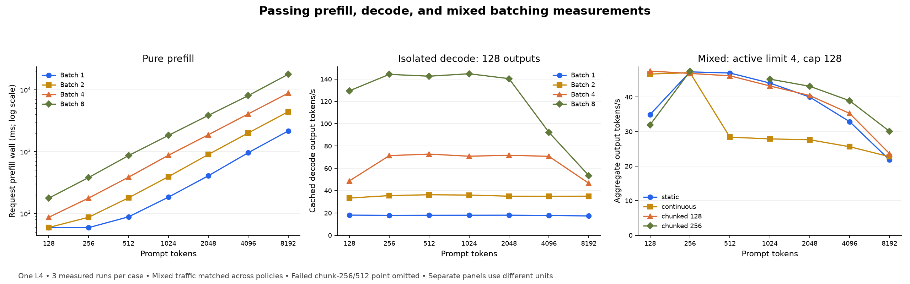

# Prefill, decode, and batching — interpretation of the completed sweep

Reviewed 2026-10-05. Model: `Qwen/Qwen3-4B-Instruct-2507-FP8`, revision `8591804019c8b22094c3b5b4454e0edc05dffc98`, one NVIDIA L4. [Full measurement tables](prefill_decode_sweep_20261003.md).

Chunked prefill improves throughput and admission latency for several batch-4/8 mixed workloads, but it increases occasional decode gaps and can regress at low concurrency. The broad matrix has unresolved correctness failures, so only passing cases below support performance comparisons. The focused Phase 8 checkpoint remains scoped to its original corpus.

## What is validated

Figure panels use separate units. The missing chunk-256 point at 512 tokens failed correctness; the plotted mixed trace uses active limit 4 and cap 128. See the tables for exact values.

All 448 configurations are accounted for: 199 pass, 237 fail exact-token correctness, and 12 are skipped by the memory guard. All 436 executed cases finish successfully at the requested output lengths and produce identical tokens across their three measured repetitions. These are numerical-output mismatches, rather than execution crashes or early truncation.

The raw audit checked 1,308 measured runs and 10,008 outputs. Of those outputs, 9,000 match HF exactly. A case fails if any output differs. Event-derived latency percentiles, aggregate throughput, isolated phase windows, and CUDA forward sums were independently recomputed for every executed case. All 98 snapshot hashes and saved prompt/reference hashes match.

## Pure prefill

Each row performs one prompt forward plus first-token selection, with no cached decode. Numbers are request prefill wall milliseconds, median across the three measured runs. All 28 points pass exact HF checks.

| Prompt tokens | Batch 1 (ms) | Batch 2 (ms) | Batch 4 (ms) | Batch 8 (ms) |
| --- | --- | --- | --- | --- |
| 128 | 59.25 | 59.27 | 86.56 | 176.44 |
| 256 | 58.98 | 86.91 | 177.36 | 380.79 |
| 512 | 88.13 | 178.88 | 385.44 | 861.38 |
| 1024 | 183.41 | 393.23 | 872.20 | 1,826.24 |
| 2048 | 406.29 | 897.20 | 1,870.18 | 3,844.21 |
| 4096 | 958.74 | 1,998.24 | 4,061.21 | 8,016.15 |
| 8192 | 2,151.94 | 4,403.23 | 8,784.55 | 17,726.18 |

Small prompts benefit from batching overhead amortization. At 128 prompt tokens, input throughput rises from about 2,206 tokens/s at batch 1 to 6,000 at batch 4. At 8192 tokens, batch 1 and batch 8 deliver about 3,810 and 3,698 input tokens/s respectively, with GPU utilization at 100%. Long-prompt prefill already fills the GPU, so more batch rows mainly add work.

## Isolated cached decode

All points below pass, use native Transformers DynamicCache, and generate 128 outputs per row. Decode throughput counts only the 127 cached steps after the first token and excludes prompt setup. This backend differs from the paged backend in the mixed-policy tables.

| Prompt tokens | Batch 1 decode TPS | Batch 2 decode TPS | Batch 4 decode TPS | Batch 8 decode TPS |
| --- | --- | --- | --- | --- |
| 128 | 18.09 | 33.39 | 48.75 | 129.47 |
| 256 | 17.87 | 35.58 | 71.41 | 144.21 |
| 512 | 17.95 | 36.35 | 72.78 | 142.58 |
| 1024 | 17.99 | 36.05 | 70.86 | 144.76 |
| 2048 | 18.03 | 35.06 | 71.74 | 140.39 |
| 4096 | 17.78 | 34.92 | 70.76 | 92.28 |
| 8192 | 17.36 | 35.08 | 46.61 | 53.55 |

At 512 prompt tokens, batch 8 reaches 142.58 decode tokens/s versus 17.95 at batch 1. At 8192 tokens, batch 4 and batch 8 reach 46.61 and 53.55 decode tokens/s; GPU utilization is 99–100%, and per-sequence TPOT rises from 85.81 to 149.40 ms. Batching still raises aggregate throughput, but long contexts limit the gain and increase each stream’s token latency.

The 128-token/batch-4 point is slower than nearby shapes, and its aggregate end-to-end rates vary from 48.23 to 53.16 tokens/s across repeats. The matrix spans several sessions and dates with fixed case order; it does not establish a smooth universal scaling curve or statistically significant small deltas. For short contexts, host enqueue time is close to CUDA forward elapsed time, consistent with substantial host dispatch overhead. That ratio is not a percentage of runtime spent on CPU: CUDA intervals include launch gaps.

## Matched mixed policies

Each comparison uses the same nine scheduled requests, 100 ms apart, with the same prompt lengths, output caps, FP8 projection policy, paged KV, and active limit. In the valid rows below the generation cap is 128, so every request emits 128 outputs. The continuous whole-prompt control uses the existing 256-token admission budget: an oversized prompt waits while decode is active. Its throughput therefore depends on that budget policy.

| Largest prompt | Active limit | Static TPS | Continuous TPS | Chunk 128 TPS | Chunk 256 TPS | Chunk 256 vs continuous |
| --- | --- | --- | --- | --- | --- | --- |
| 512 | 8 | 67.75 | 28.57 | 66.62 | 68.87 | +141.1% |
| 2048 | 4 | 39.99 | 27.63 | 40.42 | 43.10 | +56.0% |
| 2048 | 8 | 55.80 | 27.53 | 56.01 | 62.02 | +125.3% |
| 4096 | 8 | 42.34 | 25.61 | 45.78 | 52.66 | +105.6% |
| 8192 | 2 | 16.84 | 22.74 | 17.90 | 21.48 | -5.5% |
| 8192 | 4 | 21.82 | 22.74 | 23.62 | 30.07 | +32.3% |

At 4096 tokens and active limit 8, chunk 256 is 105.6% faster than the continuous control and 24.4% faster than static batching. At 8192 tokens and active limit 2, chunk 128 is 21.3% slower than the continuous control, while chunk 256 is 5.5% slower. The implementation makes many more small prefill forwards; their added overhead is a plausible contributor to the low-concurrency regressions. The evidence supports workload-dependent chunking rather than one universal preset.

### Latency trade-off: 2048-token mixed trace, active limit 4

| Policy | Output TPS | TTFT P50 (s) | Token gap P95 (ms) | E2E P95 (s) |
| --- | --- | --- | --- | --- |
| static | 39.99 | 10.26 | 64.76 | 28.29 |
| continuous | 27.63 | 16.52 | 63.80 | 41.04 |
| chunked_128 | 40.42 | 9.99 | 128.94 | 27.60 |
| chunked_256 | 43.10 | 8.94 | 133.96 | 25.81 |

Chunk 256 improves throughput from 27.63 to 43.10 tokens/s against the continuous control, reduces TTFT P50 from 16.52 to 8.94 seconds, and reduces E2E P95 from 41.04 to 25.81 seconds. P95 token gaps rise from 63.80 to 133.96 ms. Relative to static batching, its throughput gain is 7.8%, with a similar token-gap trade-off. The earlier focused Phase 8 trace uses different request counts, output lengths, and arrivals; its larger speedup must not be substituted for this comparison.

## Correctness failure patterns

The 237 failed configurations separate into three groups:

- 216 mixed configurations with generation caps 512/1048 fail on the common 128-token decoding anchor. All executed mixed cases at these caps fail, including static and whole-prompt controls.
- 18 native isolated configurations fail: prompt lengths 128/256/512, output caps 512/1048, and batches 2/4/8. Native batch 1 passes those lengths.
- Three additional 128-output configurations fail: the 512-token mixed trace with chunk 256 and active limits 1/2/4. The same chunk-specific failure also appears in the already-failing longer-cap cases.

The 1,008 differing measured request outputs have only five first-divergence signatures. Indices below are zero-based; this is a grouping of observations, not proof of five independent root causes.

| First output index | Actual token ID | HF token ID | Measured output occurrences |
| --- | --- | --- | --- |
| 365 | 5501 | 334 | 588 |
| 370 | 10262 | 5036 | 144 |
| 237 | 5501 | 334 | 84 |
| 106 | 9608 | 15003 | 108 |
| 490 | 9620 | 44364 | 84 |

### Targeted L4 replay

Eight fresh probes ran from the original frozen source and original saved prompt/reference inputs. Logit hooks synchronize and add work; none of these probe durations are performance measurements.

| Probe | Outputs per row | Exact saved batch-1 HF | First output difference | Winning logit margin at difference |
| --- | --- | --- | --- | --- |
| hf_p128_b1 | 366 | pass | — | — |
| hf_p128_b2 | 366 | FAIL | 365 | 0.1250 |
| hf_p512_b1 | 128 | pass | — | — |
| hf_p512_b2 | 128 | pass | — | — |
| paged_p128_whole | 366 | FAIL | 365 | 0.4375 |
| paged_p512_whole | 107 | pass | — | — |
| paged_p512_chunk128 | 107 | pass | — | — |
| paged_p512_chunk256 | 107 | FAIL | 106 | 3.5000 |

Fresh HF batch 1 reproduces the saved reference prefixes through the tested limits. HF batch 2 itself reproduces the 128-token prompt’s difference at output index 365, changing token 334 to 5501. Before that point the output prefixes match. At index 365, HF batch 1 chooses token 334 with a 0.0625 BF16-logit margin, while HF batch 2 chooses 5501 with margin 0.125. This directly demonstrates batch-dependent model numerics for this example; it does not establish that every paged failure has the same cause.

Whole-prompt paged decoding reproduces that long-output difference at index 365. For the 512-token prompt, HF batches 1/2, whole-prompt paged decode, and chunk 128 all match the saved prefix through the tested limits. Chunk 256 alone diverges at index 106: token 9608 wins over expected token 15003 by 3.5 logit units. The full-vector maximum difference from HF at this point is 5.03125. This is not an exact tie and is not waived as harmless rounding. Its precise source in prefill, stored KV, attention numerics, or their interaction remains unresolved.

Exact output equality also does not prove logit equality: the passing chunk-128 probe differs from HF by up to 2.75 logit units at output index 106. The whole-prompt paged probe also retains the expected winner there while its winning logit is 33.75 versus 22.5 in HF. The present benchmark gate verifies tokens; a teacher-forced, layer/cache comparison is the appropriate next diagnostic for numerical equivalence.

## Memory and scope

All 12 skips are the mixed 8192-token, active-limit-8 configurations, across the four policies and three output caps. The conservative guard estimates paged pool capacity, retained dense prefill KV, and workspace. These are predicted memory skips, not observed OOM failures or measured zeros. The isolated native batch-8 cases fit because they do not duplicate the cache in a paged pool.

The corpus uses repeated synthetic prompts and fixed arrival intervals, exact-length generation with EOS disabled, one full warm-up, and three measured repeats. It is real model inference under controlled shapes, rather than HTTP serving, diverse production traffic, or a production tail-latency study. Per-forward CUDA elapsed time includes stream launch gaps and excludes token sampling/page-copy work.

## Implications for the next checkpoint

1. Preserve the strict gate and the failed results. Do not publish the full matrix as an all-correct Phase 8 speedup result or change reference tokens to match the implementation.
2. Diagnose the chunk-256/512-token path and long paged decoding before broad performance tuning. Use batch-matched HF controls and teacher-forced prefill/KV/attention comparisons to distinguish shape-dependent model behavior from implementation error. Keep the original batch-1 comparison visible.
3. Chunk 128 is the safer tested short-output preset in this sweep, with all 27 executed 128-output mixed configurations passing. Its low-concurrency regressions still argue for a workload-aware scheduling choice. Chunk 256 has useful throughput gains, but the new failing corpus prevents promoting it as a generally validated preset.
4. For future grids, check representative correctness first, screen supported shapes, and spend repeat runs on meaningful comparisons. Short-context host dispatch and long-context GPU saturation need different optimization evidence; this sweep contains both.

## Inspectable evidence

- Source measurements: `results/prefill_decode_sweep_20261003/`, including raw request events, outputs, forward records, source snapshot, resolved configuration, and independent HF references.
- Full audit: `results/phase_sweep_review_20261005/analysis.json`.
- Logit replay: `results/phase_sweep_review_20261005/logit_diagnostic/diagnostic.json` and `selected_logits.pt`; original references are unchanged.
- Reproducible readers: [analyze_phase_sweep.py](../scripts/analyze_phase_sweep.py), [inspect_sweep_logits.py](../scripts/inspect_sweep_logits.py), and [report_phase_sweep.py](../scripts/report_phase_sweep.py).
